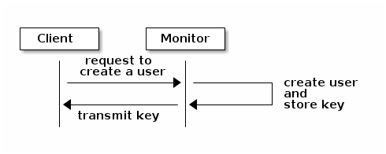
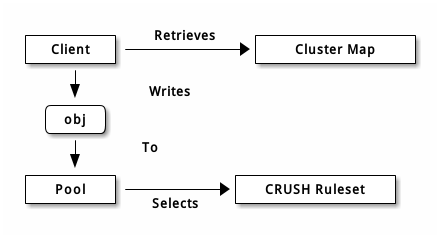
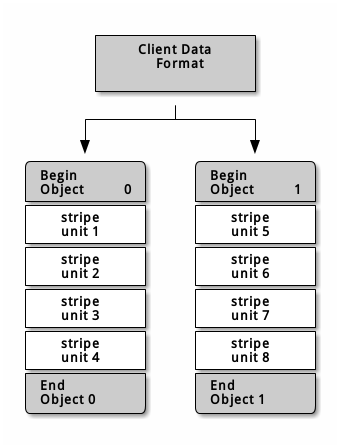
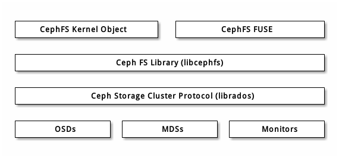

#Ceph体系结构#
-----------------------------
ceph利用统一文件系统提供了对象、块、以及文件存储。ceph高可靠性，易于管理且免费。Ceph 的强大足以改变贵公司的 IT 基础架构、和管理海量数据的能力。Ceph提供了强大的伸缩性，成千用户访问PB级甚至EB级的数据。一个Ceph节点基于普通硬件以及智能守护进程，Ceph存储集群组织大量的节点，通过相互的通信实现数据的动态复制和重分布。  
Ceph的基本架构：  
  

##Ceph存储集群##
Ceph提供了一个基于RADOS可无限伸缩的Ceph存储集群，可以参考文献[RADOS - A Scalable, Reliable Storage Service for Petabyte-scale Storage Clusters](http://ceph.com/papers/weil-rados-pdsw07.pdf)。  
Ceph存储集群主要由两类进程：
  
- Cepn Monitor  
- Ceph OSD进程

Ceph监视器维护了集群运行图的主副本。监视器集群保证了集群在监视器失效时的高可靠性。存储集群客户端向 Ceph 监视器索取集群运行图的最新副本。  
一个Ceph OSD进程会检查自身状态以及其他OSDs的状态，并上报至监视器。(Ceph中每个OSD只和以下两类节点建立心跳连接：一类是同个PG下的OSD节点之间，因为属于同个PG的OSD节点会保存同份数据的副本，如若出现故障则会直接影响数据的可用性。另一类是OSD的左右两个相邻的节点，这两个节点同自己物理上存在比较紧密的联系，例如可能连接在同台交换机。另外，如果建立心跳的Peer数目少于osd_heartbeat_min_peers，那么OSD会继续同离他较近的几个OSD建立心跳连接。)  

存储集群的客户端以及每一个Ceph OSD进程利用CRUSH算法计算数据的分布信息，不再依赖一个中心化的查询表。Ceph的高级特性包括：基于`librados`为存储集群提供原生的接口，以及基于`librados`的服务接口。  

##数据存储##

Ceph存储集群从Ceph客户端接收数据--无论数据来自Ceph块设备、ceph对象设备、Ceph文件系统或是利用librados实现的数据存储-并将数据以对象方式存储。每一个对象对应于文件系统中的一个文件，存储在Object Storage Device(OSD)。Ceph OSD守护进程在存储磁盘上执行read/write操作。  

Ceph OSD守护进程在扁平化的名字空间里将数据存储为对象(没有目录层次)。每一个对象有一个标识符，二进制数据，以及有(name,value)对组成的元数据(metadata)。元数据的定义由Ceph客户端决定。例如，CephFS使用元数据存储文件属性如文件拥有者、创建日期、最近一次修改日期等等。  
一个对象的ID在整个集群中都是独一无二的。  
  
  
##伸缩性和高可靠性##
在传统架构中，客户端与中心组件通信(如网关、中间件、 API 、前端等等)，中心组件作为一个复杂系统的唯一入口。但这种方式带来了性能和伸缩性上的限制，引入了单点故障问题(如果中心组件down掉，整个系统会down掉)。  
Ceph消除了中心网关的架构，允许客户端与Ceph OSD守护进程直接通信。Ceph守护进程在其他Ceph节点中创建对象的副本保证数据的安全和可靠性。通过监视器集群保证集群的高可靠性。 Ceph利用CRUSH算法消除了中心的节点。  

##CRUSH算法介绍##

Ceph客户端以及Ceph OSD守护进程均通过CRUSH算法计算对象的位置信息，替代了传统的中心化的查询表。CRUSH相比于传统方法提供了更好的数据管理机制，它把工作分配给集群内的所有客户端和 OSD 来处理，因此具有极大的伸缩性。CRUSH利用智能数据复制的方式确保了伸缩性，更适合超大规模的存储。在以下的内容中将详细描述CRUSH如何工作。对于CRUSH更进一步的研究，可以参考此文献[CRUSH-Controlled, Scalable, Decentralized Placement of Replicated Data](http://ceph.com/papers/weil-crush-sc06.pdf)。  
  
###集群运行图###
Ceph依赖于Ceph客户端和Ceph OSD守护进程，因为他们具有集群的拓扑。集群拓扑由5张运行图共同描述，称之为集群运行图。  
1. The Monitor Map：包含集群的fsid、位置、名字和每个监视器的端口号。还包括当前版本，如果创建了运行图，则包括最近一次修改的时间。观察监视器的运行图，执行命令`ceph mon dump`。  
2. The OSD Map：包括集群的fsid、运行图最近一次修改的时间、存储池列表(pools)、副本的数目、归置组(PG)数目、OSDs列表以及他们的状态。执行`ceph osd dump`观察OSD的运行图。  
3. The PG Map：包含PG的版本号、时间戳、最新的OSD运行图版本、PG的占满率，包括每个归置组的详细信息，包括PG ID，Up Set，Acting Set，PG的状态(active + clean，etc)，每个存储池数据利用率的统计。  
4. The CRUSH Map：包括存储设备列表、故障域的树状结构(设备、主机、机架、行、房间等)、以及存储数据时使用树状结构的规则。观察CRUSH的运行图，首先执行`ceph osd getcrushmap -o {filename}`，反编译`crushtool -d {comp-crushmap-filenmae} -o {decomp-crushmap-filename}`。然后就可利用文本工具或cat观察反编译过的运行图。  
5. The MDS Map：包含MDS运行图当前版本，运行图最近一次修改的时间。包含了存储元数据的存储池、元数据服务器的列表、以及元数据服务器的运行状态(up or in)。观察MDS map。执行`ceph mds dump`。
每一个运行图都包含了其操作变更的迭代记录。Ceph Monitor维护了集群映射图的主副本，包括集群成员、状态、变化，以及Ceph存储集群的整体状态。  

###高可靠监视器###
在ceph客户端读写数据之前，客户端必须与Ceph Monitor通信获得最新的集群运行图。一个Ceph存储集群只需要一个监视器，但会引入单点故障问题。  
为了提高可靠性以及错误容忍率，Ceph支持监视器集群。在监视器集群中，延时和错误会导致一个或多个监视器的状态滞后于当前集群的状态。针对此情况，Ceph中各个监视器必须就集群的当前状态达成一致。Ceph总是使用大多数监视一致的原则(1,2:3,3:5,4:6)和[Paxos](https://en.wikipedia.org/wiki/Paxos_(computer_science))算法就当前集群的状态达成一致。  
关于监视器的配置，参见[Monitor Config Reference](http://docs.ceph.com/docs/master/rados/configuration/mon-config-ref/)。  

###高可用的认证体系###
为了识别用户以及防止中间人攻击，Ceph采取`cephx`认证系统来认证用户和进程。  
Cephx采用共享密钥的方式实现认证，意味着客户端和监视器集群都拥有客户端密钥的拷贝。这样的认证协议使得参与双方无需展现密钥即可确认双方都拥有一份密钥的拷贝。提供了双向的认证方式，即集群确信用户拥有密钥，而且用户也相信集群拥有密钥的拷贝。  
  
Ceph的一个主要功能是避免了Ceph对象存储的中心接口，意味着Ceph客户端可以和OSDs直接进行联系。为了保护数据，Ceph提供了cephx认证系统，授权用户使用Ceph客户端。cephx协议的运行机制类似于[kerberos](https://en.wikipedia.org/wiki/Kerberos_(protocol))。  
  
用户调用客户端联系监视器。不同于Kerberos，Ceph中每个监视器都可以认证用户以及分发密钥，因此使用cephx没有单点瓶颈。监视器返回一个类似Kerberos票据的认证数据结构，认证信息包含了一个个用户获得ceph服务的会话密钥。会话密钥是用用户永久私钥自加密过的，因此只有此用户可以从Ceph监视器请求相应服务。客户端利用此会话密钥向监视器请求相应的服务，监视器为此用户提供相应的票据授权此用户向OSD读写数据。Ceph监视器与OSD共享密钥，因此客户端可以凭借监视器提供的票据向OSD和元数据服务器认证。类似Kerberos，cephx票据有时效限制，以使攻击者不能用暗中得到的过期凭证或会话密钥。只要用户的私钥过期前没有泄露 ，这种认证形式就可防止中间线路攻击者以别人的 ID 发送垃圾消息、或修改用户的正常消息。  
  
使用cephx，管理员首先需要设置用户。在下图中，`client.admin`用户通过命令行利用命令`ceph auth get-or-create-key`生成用户和密钥。Ceph认证子系统产生用户名和密钥，副本存储在监视器中并将用户的密钥传给`client.admin`用户。此时客户端和监视器共享密钥。  
  
  
要获得监视器的认证，客户端首先将用户名发给监视器。监视器产生一个会话密钥并且用用户的密钥对其加密。监视器将此加密过的会话密钥传回给客户端。客户端利用自己的密钥进行解密获得相应的会话密钥。会话密钥在当前会话中标识此用户。客户端再用此会话密钥签署过的用户名请求一个凭证，监视器生成一个凭证、用用户的密钥加密它，然后回传给客户端，客户端解密此凭证，然后用它签署连接集群内OSD和元数据服务器的请求。  
  

cephx 协议认证客户端机器和 Ceph 服务器间正在进行的通讯，二者间认证完成后的每条消息都用凭证签署过，监视器、 OSD 、元数据服务器都可用此共享的密钥来校验这些消息(因为mds，OSD都拥有用户的密钥)。其中`session key`是用来认证客户端与服务器之间会话的。获得的ticket则是用来对client与mds和osd之间通信的认证。  
  

认证提供的保护位于 Ceph 客户端和服务器间，没有扩展到 Ceph 客户端之外。如果用户从远程主机访问 Ceph 客户端， Ceph 认证就不管用了，它不会影响到用户主机和客户端主机间的通讯。  

配置细节可参考[cephx配置](http://docs.ceph.com/docs/master/rados/configuration/auth-config-ref/)，用户管理参考[用户管理](http://docs.ceph.com/docs/master/architecture/)。  

###智能进程支撑超大规模###
在众多集群架构中，集群成员关系的最主要一个目的是具有中央接口，掌握哪些节点可以接入。中央接口通过一个二级调度为客户端提供服务。但在PB及EB级的规模中却是巨大的瓶颈。  
Ceph消除了此瓶颈：Ceph OSD守护进程及Ceph客户端是集群感知的。如Ceph客户端，各个Ceph OSD守护进程都知道集群中其他的OSD守护进程。这使得OSD能够与其他OSD及监视器直接进行交互。另外，客户端可以和Ceph OSD守护进程直接交互。  
Ceph Client、Ceph OSD、Ceph Monitor之间相互交互的能力意味着Ceph OSD守护进程可以利用Ceph节点的CPU和RAM运行那些可能拖垮中央服务器的任务。均衡计算资源的能力带来很多好处。  

1. OSD Service Client Directly：由于每一个网络设备仅支持有限的并发数，规模巨大时中央系统有较大的局限性。Ceph Client直接与Ceph OSD交互的方式，消除了单点故障问题，可以有效的提高整个系统的容量和性能。Ceph Client可以维护所需的会话，Ceph OSD守护进程则替代了中央服务器。  
2. OSD Membership and Status：Ceph OSD守护进程加入集群并且上报它的状态。在底层，Ceph OSD的状态up和down反应了OSD是否在运行以及接收客户端的服务请求。当一个OSD的状态是down和in，此状态表示OSD故障。当一个OSD守护进程不在运行，OSD守护进程本身无法向monitor上报自身的状态down。Ceph monitor需周期性的ping OSD守护进程以确保OSD正在运行。然而，Ceph允许OSD去然而它也授权 OSD 进程去确认邻居 OSD 是否 down 了，并更新集群运行图、报告给监视器。这种机制意味着监视器还是轻量级进程。详情见[监控 OSD](http://docs.ceph.com/docs/master/rados/operations/monitoring-osd-pg/#monitoring-osds) 和[心跳](http://docs.ceph.com/docs/master/rados/configuration/mon-osd-interaction)。
3. Data Scrubbing：作为维护数据一致性和清洁度的一部分，OSD能清洗归置组内的对象。就是说，Ceph OSD能比较对象元数据与存储在其他OSD上的副本元数据，以捕捉OSD缺陷或文件系统错误。OSD也能做深度清洗，即按位比较对象中的数据，以找出轻度清洗时为发现的硬盘坏扇区。关于清洗配置参考[数据清洗](http://docs.ceph.com/docs/master/rados/configuration/osd-config-ref/#scrubbing)。  
4. replication：和 Ceph 客户端一样， OSD 也用 CRUSH 算法，但用于计算副本存到哪里（也用于重均衡）。一个典型的写情形是，一客户端用 CRUSH 算法算出对象应存到哪里，并把对象映射到存储池和归置组，然后查找 CRUSH 图来确定此归置组的主 OSD 。  

客户端将对象写入目标归置组的主OSD，然后这个主OSD在用它的CRUSH图副本找出用于放对象副本的第二、第三个OSD，并把数据复制带适当的归置组所对应的第二、第三OSD，最终确认数据成功存储后反馈给客户端。  

  

###动态集群管理###
Ceph的关键设计师自治，自修复，智能的OSD守护进程。接下来深入了解CRUSH如何运作，如何动态实现现代云存储基础设施的数据放置、重均衡、错误恢复。  

**存储池**  
Ceph存储系统支持池的概念，存储对象的逻辑分区。  
Ceph客户端从监视器获取一张集群运行图，并把对象写入存储池。存储池的size或副本数、CRUSH规则集合归置组数量决定着ceph如何放置数据。  
   
存储池至少可以设置以下参数：  

+ 对象的所有权/访问权限
+ 归置组的数量
+ 使用的CRUSH规则集

具体参考[调整存储池](http://docs.ceph.org.cn/rados/operations/pools#set-pool-values)。  

**PG映射到OSD**  
每个存储池都有很多归置组，CRUSH动态的把它们映射到OSD。Ceph客户端要存对象时，CRUSH将把各对象映射到某个归置组。  
把对象映射到归置组在OSD和客户端之间创建了一个间接层。由于Ceph集群必须保证较好的伸缩性，并动态的重均衡。如果让客户端掌握OSD的详细信息，造成客户端与OSD的紧耦合；相反，CRUSH算法把对象映射到归置组，然后在把归置组映射到一个或多个OSD，这一间接层可以让Ceph在OSD和底层设备上线时动态的重金恒。下图描述了CRUSH如何将对象映射到归置组、在把归置组映射到OSD。  
  
基于集群运行图副本和CRUSH算法，客户端就能精确的计算出到哪个OSD读写某特定对象。  

**计算PG ID**  
Ceph客户端绑定到某个监视器时，会索取最新的集群运行图副本。根据此图，客户端掌握集群内从优的监视器、OSD、和元数据服务器。但是，对对象位置仍是一无所知。  
对象位置是根据CRUSH计算出来的。  
客户端只需输入对象ID和存储池：ceph把数据存在某存储池中。当客户端想要存命名对象（如john、paul、george、ringo等）时，它用对象名，一个哈希值、存储池中的归置组数、存储池名计算归置组。Ceph按下列步骤计算PG ID。  

1. 客户端输入存储池ＩＤ和对象ＩＤ；
2. CRUSH拿到对象ID并哈希；
3. CRUSH用PG数对哈希值取模，得出归置组ID；
4. CRUSH根据存储池名取得存储池ID；
5. CRUSH把存储池ID加到PG ID之前

计算对象位置远快于查询定位，CRUSH算法允许客户端计算对象应该存到哪里，并允许客户端连接主OSD来存储或检索对象。  

**互联和子集**  
在前面的章节中，注意到OSD守护进程相互检查心跳并回馈给监视器；另一行为叫“互联（peering）”，这是一种把一归置组内所有对象(及其元数据)所在的OSD带到一致状态的过程。  
Ceph 存储集群被设计为至少存储两份对象数据（即 size = 2 ），这是保证数据安全的最小要求。为保证高可用性， Ceph 存储集群应该保存两份以上的对象副本（如 size = 3 且 min size = 2 ），这样才能在``degraded`` 状态继续运行，同时维持数据安全。

回想前面智能程序支撑超大规模中的图表，我们没明确地提OSD守护进程的名字（如osd.0、osd.1等等），而是称之为主、次、以此类推。按惯例，主OSD是acting set中的第一个OSD，而且它负责协调以它为主OSD的各归置组的互联，也只有它会接受客户端到某归置组内对象的写入请求。

当一系列OSD负责一归置组时，这一系列的OSD就成为一个acting set。一个acting set对应当前负责此归置组的一组OSD，或者说截止到某个版本为止负责某个特定归置组的那些OSD。

OSD守护进程作为acting set的一部分，不一定总在up状态。当一OSD在acting set中是up状态时，它就是up set的一部分。 up set是个重要特征，因为某OSD失败时Ceph会把PG映射到其他OSD。

Note 在某 PG 的 acting set 中包含了 osd.25、osd.32和osd.61，第一个osd.25是主OSD，如果它失败了，第二个osd.32 就成为主OSD，osd.25会被移出up set 。  

**重均衡**  
你向 Ceph 存储集群新增一 OSD 守护进程时，集群运行图就要用新增的 OSD 更新。回想计算 PG ID ，这个动作会更改集群运行图，因此也改变了对象位置，因为计算时的输入条件变了。下面的图描述了重均衡过程（此图很粗略，因为在大型集群里变动幅度小的多），是其中的一些而不是所有 PG 都从已有 OSD （ OSD 1 和 2 ）迁移到新 OSD （ OSD 3 ）。即使在重均衡中， CRUSH 都是稳定的，很多归置组仍维持最初的配置，且各 OSD 都腾出了些空间，所以重均衡完成后新 OSD 上不会出现负载突增。  
  

**数据一致性**  
作为维护数据一致和清洁的一部分， OSD 也能清洗归置组内的对象，也就是说， OSD 会比较归置组内位于不同 OSD 的各对象副本的元数据(size，attributes)。清洗（通常每天执行）是为捕获 OSD 缺陷和文件系统错误， OSD 也能执行深度清洗：按位比较对象内的数据；深度清洗（通常每周执行）是为捕捉那些在轻度清洗过程中未能发现的磁盘上的坏扇区。

关于数据清洗的配置见[数据清洗](http://docs.ceph.com/docs/master/rados/configuration/osd-config-ref/#scrubbing)。  

**纠删编码**  
纠删码存储池把各对象存储为 K+M 个数据块，其中有 K 个数据块和 M 个编码块。此存储池的尺寸为 K+M ，这样各块被存储到位于 acting set 中的 OSD ，块的位置也作为对象属性保存下来了。比如一纠删码存储池创建时分配了五个 OSD （ K+M = 5 ）并容忍其中两个丢失（ M = 2 ）。  

读出和写入编码块  

当包含 ABCDEFGHI 的对象 NYAN 被写入存储池时，纠删编码函数把内容分割为三个数据块，只是简单地切割为三份：第一份包含 ABC 、第二份是 DEF 、最后是 GHI ，若内容长度不是 K 的倍数则需填充；此函数还会创建两个编码块：第四个是 YXY 、第五个是 GQC ，各块分别存入 acting set 中的 OSD 内。这些块存储到相同名字（ NYAN ）的对象、但是位于不同的 OSD 上；分块顺序也必须保留，被存储为对象的一个属性（ shard_t ）追加到名字后面。包含 ABC 的块 1 存储在 OSD5 上、包含 YXY 的块 4 存储在 OSD3 上。  
  
  
从纠删码存储池中读取 NYAN 对象时，解码函数会读取三个块：包含 ABC 的块 1 ，包含 GHI 的块 3 和包含 YXY 的块 4 ，然后重建对象的原始内容 ABCDEFGHI 。解码函数被告知块 2 和 5 丢失了（被称为“擦除”），块 5 不可读是因为 OSD4 出局了。只要有三块读出就可以成功调用解码函数。 OSD2 是最慢的，其数据未被采纳。  
  
  
*被中断的完全写*  
在纠删码存储池中， up set 中的主 OSD 接受所有写操作，它负责把载荷编码为 K+M 个块并发送给其它 OSD 。它也负责维护归置组日志的一份权威版本。

在下图中，已创建了一个参数为 K = 2 + M = 1 的纠删编码归置组，存储在三个 OSD 上，两个存储 K 、一个存 M 。此归置组的 acting set 由 OSD 1 、OSD 2 、 OSD 3 组成。一个对象已被编码并存进了各 OSD ：块 D1v1 （即数据块号为 1 ，版本为 1 ）在 OSD 1 上、 D2v1 在 OSD 2 上、 C1v1 （即编码块号为 1 ，版本为 1 ）在 OSD 3 上。各 OSD 上的归置组日志都相同（即 1,1 ，表明 epoch 为 1 ，版本为 1 ）。

  

OSD 1 是主的，它从客户端收到了 WRITE FULL 请求，这意味着净载荷将会完全取代此对象，而非部分覆盖。此对象的版本 2 （ v2 ）将被创建以取代版本 1 （ v1 ）。 OSD 1 把净载荷编码为三块： D1v2 （即数据块号 1 、版本 2 ）将存入 OSD 1 、 D2v2 在 OSD 2 上、 C1v2 （即编码块号 1 版本 2 ）在 OSD 3 上，各块分别被发往目标 OSD ，包括主 OSD ，它除了存储块还负责处理写操作和维护归置组日志的权威版本。当某个 OSD 收到写入块的指令消息后，它也会新建一条归置组日志来反映变更，比如在 OSD 3 存储 C1v2 时它会把 1,2 （即 epoch 为 1 、版本为 2 ）写入它自己的日志。因为 OSD 间是异步工作的，当某些块还落盘（像 D2v2 ），其它的可能已经被确认存在磁盘上了（像 C1v1 和 D1v1 ）。  

  

如果一切顺利，各块被证实已在 acting set 中的 OSD 上了，日志的 last_complete 指针就会从 1,1 改为指向 1,2 。  

  

最后，用于存储对象前一版本的文件就可以删除了： OSD 1 上的 D1v1 、 OSD 2 上的 D2v1 和 OSD 3 上的 C1v1 。  

  
  
但是意外发生了，如果 OSD 1 挂了、同时 D2v2 仍未完成，此对象的版本 2 一部分已被写入了： OSD 3 有一块但是不足以恢复；它丢失了两块： D1v2 和 D2v2 ，并且纠删编码参数 K = 2 、 M = 1 要求至少有两块可用才能重建出第三块。 OSD 4 成为新的主 OSD ，它发现 last_complete 日志条目（即在此条目之前的所有对象在之前 acting set 中的 OSD 上都可用）是 1,1 那么它将是新权威日志的头条。  
  

在 OSD 3 上发现的日志条目 1,2 与 OSD 4 上新的权威日志有分歧：它将被忽略、且包含 C1v2 块的文件也被删除。 D1v1 块将在清洗期间通过纠删码库的 decode 解码功能重建，并存储到新的主 OSD 4 上。  
  

###[缓存分级](http://docs.ceph.org.cn/rados/operations/cache-tiering)###
对于后端存储层上的部分热点数据，缓存层能向 Ceph 客户端提供更好的 IO 性能。缓存分层包含由相对高速、昂贵的存储设备（如固态硬盘）创建的存储池，并配置为 缓存层；以及一个后端存储池，可以用纠删码编码的或者相对低速、便宜的设备，作为经济存储层。 Ceph 对象管理器会决定往哪里放置对象，分层代理决定何时把缓存层的对象刷回后端存储层。所以缓存层和后端存储层对 Ceph 客户端来说是完全透明的。  
  

缓存层代理自动处理缓存层和后端存储之间的数据迁移。然而，管理员仍可干预此迁移规则，主要有两种场景：

+ 回写模式： 管理员把缓存层配置为 writeback 模式时， Ceph 客户端们会把数据写入缓存层、并收到缓存层发来的 ACK ；写入缓存层的数据会被迁移到存储层、然后从缓存层刷掉。直观地看，缓存层位于后端存储层的“前面”，当 Ceph 客户端要读取的数据位于存储层时，缓存层代理会把这些数据迁移到缓存层，然后再发往 Ceph 客户端。从此， Ceph 客户端将与缓存层进行 I/O 操作，直到数据不再被读写。此模式对于易变数据来说较理想（如照片/视频编辑、事务数据等）。
+ 只读模式： 管理员把缓存层配置为 readonly 模式时， Ceph 直接把数据写入后端。读取时， Ceph 把相应对象从后端复制到缓存层，根据已定义策略、脏对象会被缓存层踢出。此模式适合不变数据（如社交网络上展示的图片/视频、 DNA 数据、 X-Ray 照片等），因为从缓存层读出的数据可能包含过期数据，即一致性较差。对易变数据不要用 readonly 模式。  

###扩展Ceph###
  
你可以通过创建 ‘Ceph Classes’ 共享对象类来扩展 Ceph 功能， Ceph 会动态地载入位于 osd class dir 目录下的 .so 类文件（即默认的 $libdir/rados-classes ）。如果你实现了一个类，就可以创建新的对象方法去调用 Ceph 对象存储内的原生方法、或者公用库或自建库里的其它类方法。

写入时， Ceph 类能调用原生或类方法，对入栈数据执行任意操作、生成最终写事务，并由 Ceph 原子地应用。

读出时， Ceph 类能调用原生或类方法，对出栈数据执行任意操作、把数据返回给客户端。  

> Ceph 类实例  
> 
一个为内容管理系统写的类可能要实现如下功能，它要展示特定尺寸和长宽比的位图，所以入栈图片要裁剪为特定长宽比、缩放它、并嵌入个不可见的版权或水印用于保护知识产权；然后把生成的位图保存为对象。  

典型的实现见`src/objclass/objclass.h `、 `src/fooclass.cc` 、和 `src/barclass`。  

###Ceph协议###
Ceph客户端用原生协议和存储集群交互，Ceph将此功能封装进librados库，这样就能创建自己的定制客户端，下图描述了基本架构。  
  

**原生协议和LIBRADOS**  
现代程序都需要可异步通讯的简单对象存储接口。Ceph存储集群提供了一个有异步通讯能力的简单对象存储接口，此接口提供了直接、并行访问集群对象的功能。  

+ 存储池操作；
+ 快照和写时复制克隆；
+ 读/写对象；-创建或删除；-整个对象或某个字节范围；-追加或裁接；
+ 创建/设置/获取/删除扩展属性；
+ 创建/设置/获取/删除键/值对；
+ 混合操作和双重确认；
+ 对象类。

**对象监视/通知**   
客户端可以注册对某个对象的持续兴趣，并直到主OSD的会话保持打开。客户端可以发送一个通知消息和载荷给所有监视者、并可收集监视者的回馈通知。这个功能使得客户端可把任意对象用作同步/通讯通道。  
  

**数据条带化**  
存储设备都有吞吐量限制，它会影响性能和伸缩性，所以存储系统一般都支持条带化（把连续的信息分片存储于多个设备）以增加吞吐量和性能。数据条带化最常见于 RAID 中， RAID 中最接近 Ceph 条带化方式的是 RAID 0 、或者条带卷， Ceph 的条带化提供了像 RAID 0 一样的吞吐量、像 N 路 RAID 镜像一样的可靠性、和更快的恢复。  
Ceph提供了三种类型的客户端：块设备、文件系统和对象存储。Ceph客户端把展现给用户的数据格式（一块设备映像、REST风格对象、CephFSB文件系统目录）转换为可存储于Ceph存储集群的对象。  
> Tip： 在Ceph存储集群的那些对象是没有条带化的。Ceph对象存储、Ceph块设备、和Ceph文件系统把他们的数据条带化到Ceph存储集群内的多个对象，客户端通过librados直接写入Ceph存储集群前必须先自己条带化（和并行I/O）才能享受这些优势。  

最简单的 Ceph 条带化形式就是一个对象的条带。 Ceph 客户端把条带单元写入 Ceph 存储的对象，直到对象容量达到上限，才会再创建另一个对象存储未完的数据。这种最简单的条带化对小的块设备映像、 S3 、 Swift 对象或 CephFS 文件来说也许足够了；然而这种简单的形式不能最大化 Ceph 在归置组间分布数据的能力，也就不能最大化性能。下图描述了条带化的最简形式：  
  

如果要处理大尺寸图像、大 S3 或 Swift 对象（如视频）、或大的 CephFS 目录，你就能看到条带化到一个对象集合中的多个对象能带来显著的读/写性能提升。当客户端把条带单元并行地写入相应对象时，就会有明显的写性能，因为对象映射到了不同的归置组、并进一步映射到不同 OSD ，可以并行地以最大速度写入。到单一磁盘的写入受限于磁头移动（如：6ms 寻道时间）和存储设备带宽（如：100MB/s）， Ceph把写入分布到多个对象（它们映射到了不同归置组和 OSD ），这样可减少每设备寻道次数、联合多个驱动器的吞吐量，以达到更高的写（或读）速度。  
>Note：条带化独立于对象复制。因为CRUSH会在OSD间复制对象，数据条带是自动被复制的。  

在下图中，客户端数据条带化到一个对象集（下图中的 `object set 1` ），它包含 4 个对象，其中，第一个条带单元是 `object 0` 的 `stripe unit 0` 、第四个条带是 `object 3` 的 `stripe unit 3` ，写完第四个条带，客户端要确认对象集是否满了。如果对象集没满，客户端再从第一个对象起写入条带（下图中的 `object 0` ）；如果对象集满了，客户端就得创建新对象集（下图的 `object set 2` ），然后从新对象集中的第一个对象（下图中的 `object 4` ）起开始写入第一个条带（ `stripe unit 16` ）。  

  

三个重要变量决定着Ceph如何条带化数据：
  
+ **对象尺寸**：Ceph 存储集群里的对象有最大可配置尺寸（如 2MB 、 4MB 等等），对象尺寸必须足够大以便容纳很多条带单元、而且应该是条带单元的整数倍。
+ **条带宽度**： 条带都有可配置的单元尺寸（如 64KB ）。 Ceph 客户端把数据等分成适合写入对象的条带单元，除了最后一个。条带宽度应该是对象尺寸的分片，这样对象才能 包含很多条带单元。  
+ **条带数量**：Ceph客户端一系列条带单元写入由条带数量所确定的一系列对象，这一系列的对象称为一个对象集。客户端写到对象集内的最后一个对象时，再返回到第一个。  

`Important：把集群投入生产环境前要先测试条带化配置的性能，因为把数据条带化到对象中之后这些参数就不可更改了。`  

Ceph 客户端把数据等分为条带单元并映射到对象后，用 CRUSH 算法把对象映射到归置组、归置组映射到 OSD ，然后才能以文件形式存储到硬盘上。  

>Note：因为客户端写入单个存储池，条带化到对象的所有数据也被映射到同一存储池内的归置组，所以它们要使用相同的 CRUSH 图和相同的访问权限。  

###Ceph客户端###
-----------------------------
Ceph客户端包括数种服务接口，有：

+ **块设备**：Ceph 块设备（也叫 RBD ）服务提供了大小可调、精炼、支持快照和克隆的块设备。为提供高性能， Ceph 把块设备条带化到整个集群。 Ceph 同时支持内核对象（ KO ） 和 QEMU 管理程序直接使用``librbd`` ——避免了内核对象在虚拟系统上的开销。
+ **对象存储**： Ceph 对象存储（也叫 RGW ）服务提供了 `RESTful 风格`_的 API ，它与 Amazon S3 和 OpenStack Swift 兼容。
+ **文件系统**： Ceph 文件系统（ CephFS ）服务提供了兼容 POSIX 的文件系统，可以直接 mount 或挂载为用户空间文件系统（ FUSE ）。  

Ceph 能额外运行多个 OSD 、 MDS 、和监视器来保证伸缩性和高可靠性，下图描述了高级架构。  

**Ceph对象存储**  
--------------
Ceph 对象存储守护进程， radosgw ，是一个 FastCGI 服务，它提供了 `RESTful 风格`_ HTTP API 用于存储对象和元数据。它位于 Ceph 存储集群之上，有自己的数据格式，并维护着自己的用户数据库、认证、和访问控制。 RADOS 网关使用统一的命名空间，也就是说，你可以用 OpenStack Swift 兼容的 API 或者 Amazon S3 兼容的 API ；例如，你可以用一个程序通过 S3 兼容 API 写入数据、然后用另一个程序通过 Swift 兼容 API 读出。  
>**S3/Swift对象和存储集群对象比较**  
>Ceph 对象存储用对象这个术语来描述它存储的数据。 S3 和 Swift 对象不同于 Ceph 写入存储集群的对象， Ceph 对象存储系统内的对象可以映射到 Ceph 存储集群内的对象； S3 和 Swift 对象却不一定 1:1 地映射到存储集群内的对象，它有可能映射到了多个 Ceph 对象。  

**Ceph块设备**  
-----------------
Ceph 块设备把一个设备映像条带化到集群内的多个对象，其中各对象映射到一个归置组并分布出去，这些归置组会分散到整个集群的 ceph-osd 守护进程上。  
精简的、可快照的 Ceph 块设备对虚拟化和云计算很有吸引力。在虚拟机场景中，人们一般会用 Qemu/KVM 中的 rbd 网络存储驱动部署 Ceph 块设备，其中宿主机用 librbd 向客户机提供块设备服务；很多云计算堆栈用 libvirt 和管理程序集成。你可以用精简的 Ceph 块设备搭配 Qemu 和`libvirt` 来支持 OpenStack 和 CloudStack ，一起构成完整的方案。

现在`librbd`还不支持其它管理程序，你也可以用 Ceph 块设备内核对象向客户端提供块设备。其它虚拟化技术，像 Xen 能访问 Ceph 块设备内核对象，用命令行工具 rbd 实现。  

**Ceph文件系统**  
-------------------------

Ceph 文件系统（ Ceph FS ）提供与 POSIX 兼容的文件系统服务，坐于基于对象的 Ceph 存储集群之上，其内的文件被映射到 Ceph 存储集群内的对象。客户端可以把此文件系统挂载在内核对象或用户空间文件系统（ FUSE ）上。  

  

Ceph 文件系统服务包含随 Ceph 存储集群部署的元数据服务器（ MDS ）。 MDS 的作用是把所有文件系统元数据（目录、文件所有者、访问模式等等）永久存储在相当可靠的元数据服务器中内存中。 MDS （名为 ceph-mds 的守护进程）存在的原因是，简单的文件系统操作像列出目录（ ls ）、或进入目录（ cd ）这些操作会不必要的扰动``OSD``。所以把元数据从数据里分出来意味着 Ceph 文件系统能提供高性能服务，又能减轻存储集群负载。

Ceph FS 从数据中分离出了元数据、并存储于 MDS ，文件数据存储于存储集群中的一或多个对象。 Ceph 力争兼容 POSIX 。 ceph-mds 可以只运行一个，也可以分布于多台物理机器，以获得高可用性或伸缩性。  

+ **高可用性**：多余的 ceph-mds 例程可处于 standby （待命）状态，随时准备替下之前处于 active （活跃）状态的故障 ceph-mds 。这可以轻易做到，因为所有数据、包括日志都存储在 RADOS 上，这个转换过程由 ceph-mon 自动触发。  
+ **伸缩性**：多个 ceph-mds 例程可以同时处于 active 状态，它们会把目录树拆分为子树（和单个热点目录的分片），在所有活跃服务器间高效地均衡负载。  

>目前MDS的稳定性尚不理想。多个活跃的MDS远没一个稳定。