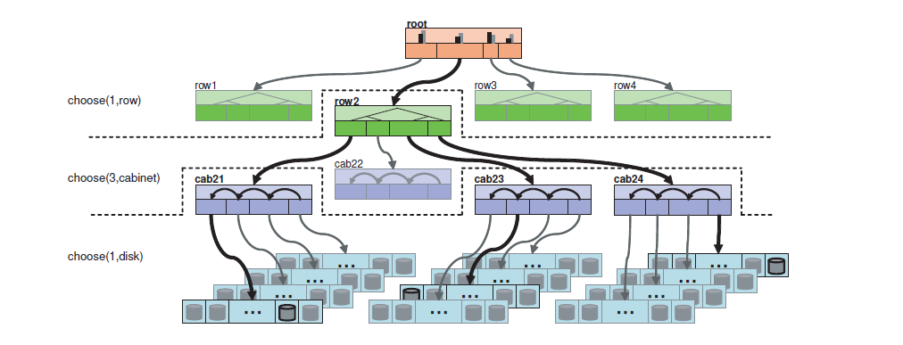
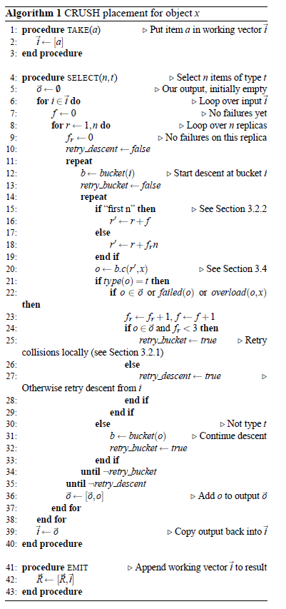

#Ceph-CRUSH#
---------------------------
ceph中Pool的属性有：1.object的副本数，  2.Placement Groups的数量，   3.所使用的CRUSH Ruleset。  
 数据映射（Data Placement）的方式决定了存储系统的性能和扩展性。（Pool，PG）→ OSD set的映射由四个因素决定：  
1. CRUSH 算法
2. OSD MAP
3. CRUSH MAP

OSD MAP包含了集群的fsid，以及pools，以及副本的数目，OSD的状态，查看OSD MAP可执行`ceph osd dump`；  
CRUSH MAP：包含了当前磁盘、服务器、机架的层级架构，以及crush rule。即object映射的规则。

CRUSH：可扩展伪随机数据分布函数。针对分布式对象存储系统，可以有效的实现数据的映射，而无需依赖中央映射表。CRUSH的主要目的在于减少存储设备的加入或移除而带来的数据迁移。

Cluster Map由device和bucket组成，device以及bucket具有数字id以及相应的权重。Buckets可以包含任意个devices以及其他buckets。组成分层存储的内部节点，而叶子节点通常是device。device权重通常由管理员分配，而bucket权重为其所含的items的权重之和。Device权重与其所需要承载的数据量有关。

CRUSH算法的设计就是要在不同权重的device之间分配存储数据以均衡资源利用率。CRUSH定义了placement rule用以决定object的存储位置。

**Placement Rule计算方法如下：**  
  
每一个rule的计算都是不断的迭代过程。是对分层架构不断的操作所得到的。表1表示了一个rule。存储点的选择如下图所示。  
   
首先select(1,row)选择一个类型为row的bucket。图中选择了row2，item的选择是利用随机函数c(r,x)确定的。在bucket row2中包含了4个item(bucket cab21 cab22 cab23 cab24)。select(3,cabinet)选择3个类型为cabinet的bucket，在此次选择的过程中选择了cab21 cab23 cab24。select(1,disk)表示选择1个disk。迭代的过程中，需要分别从cab21 cab22 cab23分别选择一个类型为disk的磁盘。

select(n,t)算法的具体流程如下：  
    
其中输入为x，输出为n个目标。表示n个副本存放的位置。  
其中take(a)是在分层架构中的根节点中选取`item(bucket/device)`，将其复制给`subitem`。`subitem`将作为后续的操作的输入。`select(n,t)`表示在当前层次选取`n`个类型为`t`的不同`item`。如在`subitem`为输入的迭代过程中，执行`select(n,t)`，则迭代所有`item in subitem`，选择n个不同类型为`t`的`item`。其中item的选择是采用函数c(r,x)。当利用c(r,x)选择item类型不符时，则对`bucket(o)`递归进行处理。若选择的item发生collsion, failed, overload时，则重新选择。  

在算法Line 22处理三种选择失败的的情况：  
1. 选择冲突，第r个replica选择bucket(/device) o，但是o已被1~r-1中某个replica选择。  
2. Device故障，在选择replica device的过程中，目标device failed，failed(o)。  
3. 目标device过载。  

重新选择算法主要分成以下两种：  
  
r'=r+f以及r'=r+f'n。其中f以及f'表示选择失败的次数。r'=r+f是平移策略，假设在不失败的状况下，select(6,t)的结果是(a,b,c,d,e,f)。则左图中当选择item(b)失败，r'=r+1，利用c替代了b，同理d替代了c，选择结果变成(a,c,d,e,f,g)。r'=r+f'n则是位置敏感的替换策略，固定item的相对位置顺序，利用r'=r+f'n选择的item替换失败item。如右图，item(b)失败，n=6，r'=2+1*6=8，则item(h)替换，选择结果为(a,h,c,d,e,f,g)。  
两种策略的应用场景如下：1、存储采用的是基本的多副本拷贝策略，2、采用奇偶校验或是纠删码存储的策略。由于多副本对存储的设备的顺序无要求，因此采用第一种替换策略。而对于奇偶校验以及纠删码存储需要保证存储的顺序，对存储设备的顺序敏感，因此采用第二种方案。  

##Map更新及数据迁移##
当一个独立的存储出现故障时，监视器会将其标记为(down，in)状态，表示仍承载数据，但是暂时出现故障，可能恢复也可能不恢复，此时此OSD无法读取数据。若OSD恢复后，状态标记为(up，in)。若经过特定时间仍为恢复，则状态标识为(down，out)。OSD状态发生变化后，监视器更新crush map。由于监视器是最先掌握OSD状态的，因此，监视器掌握集群最新的map。同样客户端及OSD的map，采用Lazy更新的模式。客户端与监视器或OSD交互时，发现对方具有更新的版本后，才开始更新自身map版本。OSD map的更新则在OSD与OSD交互或与监视器交互时检查版本更新。   

当有OSD添加时，会有数据的迁移。为了防止数据迁移导致的资源消耗，在生产环境中可以关闭自动均衡，`ceph osd set noout`，在启用OSD，`start ceph-osd id={num}`。  

##Bucket类型##
CRUSH定义了四种类型的bucket：Uniform buckets，List buckets，Tree buckets，Straw buckets。每一种bucket都有不同的内部数据结构以及伪随机选择函数c(r,x)。
  
+ **Uniform Bucket**：
包含的item权重相同，c(r,x)=(hash(x)+rp)mod*m*， p是一个大于m的随机数。  
+ **List Bucket**：链表结构，可以包含任意权重的item。CRUSH从链表头部开始选择，得到链表头部的权重wh，以及其余item的权重和ws。得到一个has(x,tr,item)的直u，若u在[0,wh/ws]中，则选择当前链表头部item。否则副本存放位置位与剩余链表中，继续运行寻找。
+ **Tree Bucket**：链表结构的bucket的复杂度是O(n)，适合于小规模的 items。而二叉树的查找复杂度为O(lgn)。Tree Bucket是一个加权二叉搜索树，每个节点的权重为左右子树的权重之和，item位于叶节点。二叉树搜索时，计算hash(x，r，bucket\_id，node\_id)， 获得一个值v属于[0,1]，与当前节点的左右子树的权重比较(wl,wr)，若v位于[0,wl/wl+wr]则继续搜索左子树，否在在右子树中。（node\_id是一个固定的二进制值，当添加以及移除一个item时，其余node\_id不变。最左边的节点始终为1，当tree扩展时，old root变成root的左子树，同时root的id为old root id的左移一位。如下图所示，node_id根据中序遍历的顺序）。
+ **Straw Bucket**：List以及Tree都是根据权重进行的选择。Straw Bucket让所有item公平竞争。无需遍历。c(r,x)=Max(f(wi)*hash(x,r,i))，其中i是item的id，f(wi)与item(i)的权重相关。  

  

每个bucket的select的时间复杂度以及增删item下数据迁移的性能如下表：  
  

  
    

Command：  
Note：查看CRUSH RuleSet：  
>`ceph osd getcrushmap -o {crush-map-complie}`  
>`crushtool -d {crush-map-complie} -o {crushmap-file}`  
>`cat {crushmap-file}`  

图示：

