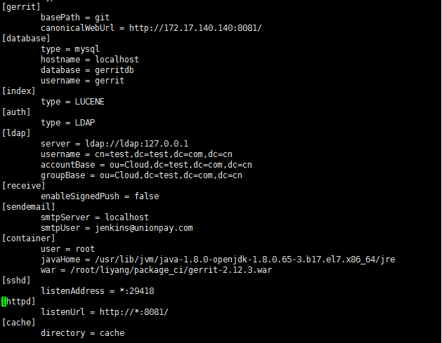
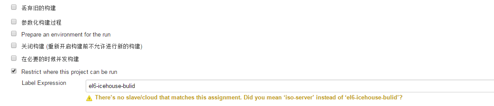

##9月22日##
主要工作：  
Gerrit、Jenkins的安装配置，Jobs的导入。  

部署方案：  
<table border="1">
<tr><td>硬件</td><td>虚拟机2台(Centos7.2；Node1：4core，16G；Node2：4core，8G)</td></tr>
<tr><td>安装组件</td><td>Gerrit，Jenkins</td></tr>
<tr><td>部署方案</td><td>Gerrit：代码审查平台，备份至gitlab，用户管理：ldap；Jenkins：Master，slave1(ccontainer，rpm jobs)，slave2(ios-build)，Tempest、Roller。</td></tr>
<tr><td>实现方案</td><td>Node1：Gerrit，Jenkins:master，Jenkins:slave1(docker，rpm)；Node2：slave2(ios-build)，Tempest，Roller。</td></tr>
</table>

方案实现原理：  
Gerrit作为独立的代码审查平台，Jenkins作为代码打包(rpm)，以及发布的工具，build为ios文件，利用tempest进行部署。Gerrit与gitlab对接，将本地库备份至gitlab，利用ldap实现用户管理。  
Jenkins master作为调度器，包含两类job，一类打包rpm job，一类ios-build job。其中rpm job运行于container环境中，ios-build job运行于独立的节点上，与tempest，roller共同部署在同一个节点。在初次安装时，需要将gitlab库中的库更新至本地，在随后打包时，自动更新。Jenkins的job需要手动构建。  

Gerrit的安装：  
设置镜像源，利用银联的Centos源代替官方源。  
银联源：d:/虚拟机文件/*  

安装过程：  

    配置银联源
    $yum makecache

    $yum install -y java  #安装java

    $echo "StrictHostKeyChecking no" >> /etc/ssh/ssh_config

    安装数据库
    $yum install   mariadb.x86_64 mariadb-libs.x86_64 mariadb-server.x86_64 -y
    $systemctl start mariadb（可能未启动，查看每个上述安装程序的每个状态，$systemctl status mariadb）
    $systemctl enable mariadb  (也可以装Mysql)
    
    创建gerrit用户：
    $useradd gerrit -m
    $passwd gerrit

    数据库配置
    用实际密码替代 'OStem@00'
    $mysql -u root
    $create database gerritdb;
    $create user gerrit IDENTIFIED BY 'OStem@00';
    $grant all privileges on gerritdb.* to 'gerrit'@'localhost' identified by 'OStem@00';
    $grant all privileges on *.* to 'root'@'%';
    $grant all privileges on *.* to 'root'@'localhost';
    $FLUSH privileges;
    $exit
     
    以下安装过程中会需要安装多个插件，可以先忽略，后续安装
    如：cp mysql-connector-java-5.1.21.jar   /etc/gerrit/gerrit_site/lib/
    切换至gerrit用户，将gerrit安装包放在gerrit目录下。

    $java -jar gerrit-2.12.3.war init -d /etc/gerrit/gerrit_site/
   
    
安装过程的配置文件如下：
     
配置参数说明：

	canonicalWebUrl是接入url；  
	数据库：Mysql
	数据库：为前面建立的库gerritdb  
	用户名和密码：为gerrit，以及为gerrit设置的接入mysql的密码
	认证方式：[auth] type = LDAP
	ldap的配置：需要提供公司ldap的server，username，accountBase，groupBase
	配置SMTP服务器及邮件：	smtpServer、smtpPort、smtpUser、smtpPass、smtpFrom等信息。
	将container中的root用户更改为gerrit。
	sshd的监听端口默认设置。
	http的监听端口更改为8081，默认的8080可能与其他冲突。  
    
    war = /home/gerrit/gerrit-2.12.3.war

插件安装，内网环境无法联网安装：  

	cp mysql-connector-java-5.1.21.jar   /etc/gerrit/gerrit_site/lib/ #必须的插件
	
	download:
	http://www.bouncycastle.org/download/bcpkix-jdk15on-151.jar
	and save as:
	/home/gerrit/gerrit_site/lib/bcpkix-jdk15on-151.jar
	
	Install plugin download-commands version v2.11.3 [y/N]? 
	Install plugin reviewnotes version v2.11.3 [y/N]? 
	Install plugin singleusergroup version v2.11.3 [y/N]? 
	Install plugin replication version v2.11.3 [y/N]? 
	Install plugin commit-message-length-validator version v2.11.3 [y/N]? 
	(上述插件已包含在gerrit_site/plugin下了)
	
其中replication必须安装。
插件下载地址[Link](http://builds.quelltextlich.at/gerrit/nightly/master/latest-ok/index.html)。

gerrit需要进一步的配置。  
replication的配置：  
参见[LINK](https://gerrit.wmi.amu.edu.pl/Documentation/config-replication.html)  
示例：  

    在gitlab上创建项目，添加gerrit用户，gerrit生成密钥，上传密钥。测试是否能push。
	git clone --bare gitlab/*  #拉下项目
	
	vi /home/gerrit_site/etc/replication.config
	
	[remote "gitlab"]
	url = gerrit@gitlab:/home/gerrit/gerrit_site/git/${name}.git
	push = +refs/heads/*:refs/heads/*
	push = +refs/tags/*:refs/tags/*
	mirror = true
	threads = 3
	replicationDelay = 0
	
	$name，表示同步git/下所有的项目。

注意事项：gerrit第一个登陆的用户为管理员。  

##Jenkins安装配置##

安装必要的依赖：  

	yum install gcc gcc-c++ autoconf glibc glibc-devel curl curl-devel ncurses ncurses-devel
	yum install rpm-build wget
	yum install java
	
	配置本地源
	/etc/yum.repos.d/ftp.repo
	
	[local]
	name=local
	baseurl=file:///root/liyang/rpms_ci
	gpgcheck=0
	enable=1
	
	
	安装jenkins  
	yum install jenkins.noarch   #从本地源找

	systemctl start jenkins
	systemctl enable jenkins
	systemctl stop firewalld.service 
	
	安装插件
	cp -r /root/liyang/package_ci/plugins/* /var/lib/jenkins/plugins
	systemctl restart jenkins
	chrown -R jenkins:jenkins /var/lib/jenkins
	
	安装jobs：
	将对应的jobs拷贝至 /var/lib/jenkins/jobs
    systemctl restart jenkins
    
    依赖包
	yum install python-sphinx
	yum install python-boto python-django-openstack-auth

    添加slave节点：界面操作
    需要将slave.jar包添加至/home/jenkins/目录下。

    
	在打rpm包时会缺少很多依赖程序：
	在requirements.txt会包含此依赖包，shell脚本：  
	for i in `cat rpm-requirements.txt`;do echo $i; yum -y install $i; done;

/var/lib/jenkins/userContent下是jobs构建rpm包的脚本。要指定某个job在指定的node运行只需要在job的配置中label expression：
  
###打rpm包的job需要在容器中运行，如何指定此容器？job会自动起容器还是需要一直讲容器开着，指定job在此容器中运行？
