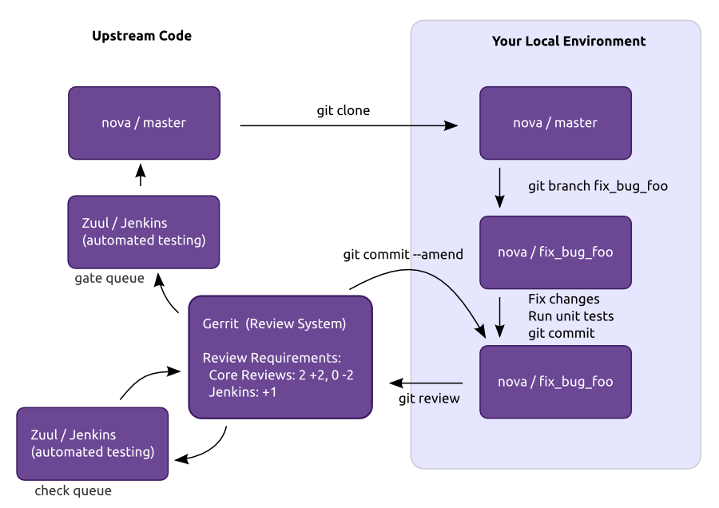
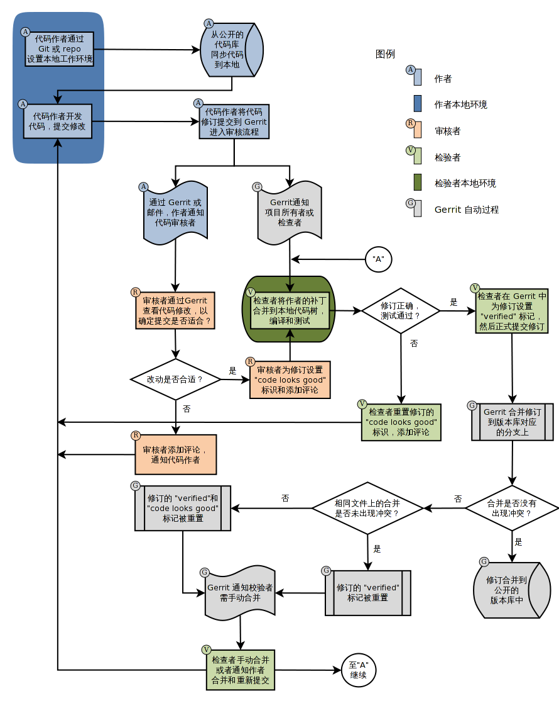

#Openstack CI System#
-----------------------------------
Openstack Infra Project是运行在openstack云上的openstack集成开发测试系统，集成gerrit实现openstack项目的团队合作开发，以及代码的自动化测试。  
下图是协作开发的一个流程图：  
   

其中项目的开发者主要在本地的环境进行开发。Upstream Code主要是项目协作及测试平台。一个完整的Openstack Infra系统包含了开发、测试、以及协作工具。  

##关键组件及配置##
###Gerrit###
gerrit架构：  
  
上图显示了gerrit的一个基本的工作流程。  
在gerrit中，每个开发者只能`git review`，不能`git push`，只有经过项目核心成员审查，测试通过后才能被merge。  

**项目管理**  
创建项目：  

+ 通过web页面创建；
+ Rest接口；
+ ssh command。

项目状态：

+ Active：项目正常状态；
+ Read only：丢弃所有changes，只能读；
+ Hidden：只有project owner可见。

**权限控制**  
在gerrit中权限控制是基于群组的. 每个用户有一个或者多个群组, 访问权限被赋予这些群组.访问权限不能赋予个人用户。  
在Gerrit系统自带下面的群组：

+ Anonymous Users
+ Change Owner
+ Project Owners
+ Registered Users

*Anonymous Users*  
所有用户都是匿名用户成员, 所有用户都能继承Anonymous Users所有访问权限，只有只读权限。

*Change Owner*  
change owner的访问权限在Change范围内有效。  

*Project Owner*  
Project Owner具有对项目的管理权限。可以不经代码审核直接推送，其具有+2..-2的权限，可以对changes实现approval。

*Registered Users*
所有在页面上登录成功的用户都会自动注册为gerrit用户，属于Registered Users群组。
Registered Users群组通常被赋予Code-Review -1..+1权限, 允许给需要审查代码投票, 但不会引起审查被批准和拒绝。

在openstack infra系统中，有四个主要的用户组：  

+ Project Bootstrappers group：具有创建项目所需的一切权限。
+ Third-Party CI group：+/-1权限，包含针对sandbox项目的测试工具。
+ Voting Third-Party CI group：=/-1权限，包含针对所有项目的测试工具。
+ Continuous Integration Tools group：+/-2权限，包含jenkins以及一些其他的CI工具。
+ Release Managers group：项目发布管理。

**接入控制**  
接入控制的设置主要在项目文件project.config，以及groups文件中。其中groups主要是用户组与uuid的映射关系。project.config主要包含了权限的管理。如下：  

    [project]
       description = Rights inherited by all other projects
    [access "refs/*"]
       read = group Administrators
    [access "refs/heads/*"]
        label-Your-Label-Here = -1..+1 group Administrators
    [capability]
       administrateServer = group Administrators
    [receive]
       requireContributorAgreement = false
    [label "Your-Label-Here"]
        function = MaxWithBlock
        value = -1 Your -1 Description
        value =  0 Your No score Description
        value = +1 Your +1 Description

包含多个选项。每个选项下包含相应的关键字和对应的设置值。
##Jenkins及Zuul##
