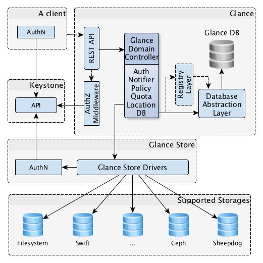
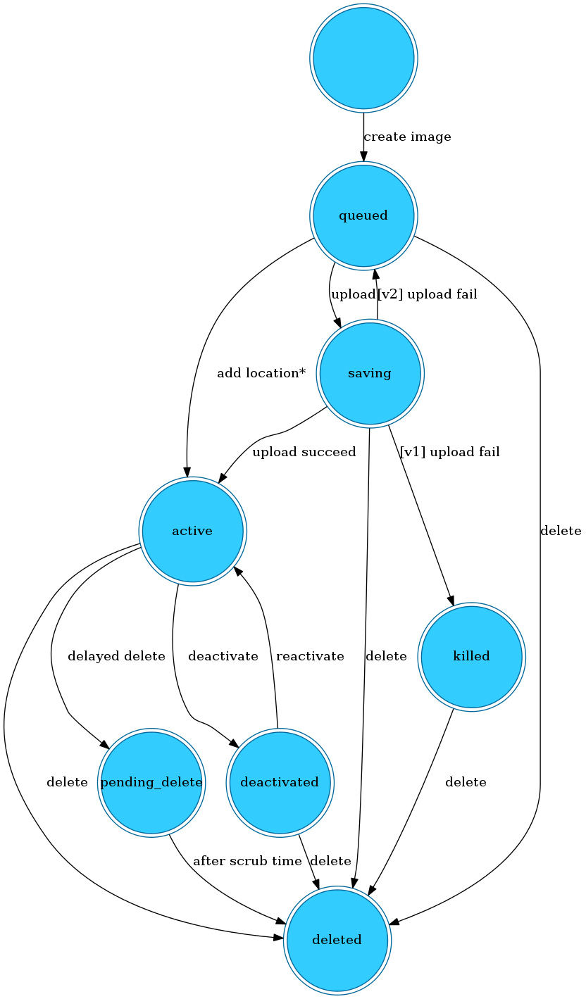

#Glance#
-------------------------------
Glance是openstack中的镜像服务，使得用户可以发现、注册、检索虚拟机镜像。Glance提供了*Rest* API用于查询虚拟机镜像的元数据以及检索真实的镜像。基于文件系统或者openstack的对象存储系统，利用镜像服务来存储虚拟机镜像。
  
Glance包含以下几个重要的组件：  
**Glance API**  
是一个对外的API接口，能够接受外部的API镜像请求。主要用于分析、分发、响应各种镜像管理的REST Request，然后通过其他模块(EG. glance-registry、Store Backend后端存储接口)完成镜像的发现、获取、存储等操作。默认绑定端口是9292。   
**Glance Register**  
用于存储、处理、获取Image Metadata。通过响应从glance-api发送过来的Image Metadata REST Request，然后与MySQL进行交互，实现Image Metadate的存储、处理、获取。默认绑定的端口是9191。  
**DataBase**  
存储镜像的元数据；  
**Storage repository for image files**  
镜像文件第三方存储的驱动。支持文件系统、对象存储、基于RADOS的块设备、HTTP、Amazon S3。  

##Glance基本架构##
  

Glance通过rest接口对外提供服务。  
其中Database Abstraction Layer (DAL)是应用程序接口，统一glance与数据库的连接。  
Glance Domain Controller：实现Glance主要功能的中间件，如 authorization, notifications, policies, database connections等主要功能。  
Glance Store：支持第三方存储。  
Ragistry Layer：用于实现domain与DAL之间的安全连接。  

Glance Datebase Architecture：  

  
在glance数据库表针对image维护了多张表，代表了image不同的属性。  

+ 其中image表代表了image默认的一些元数据信息，包含了img\_id、disk\_format、container\_format、min\_ram、min\_disk、base\_image\_ref等Properties；
+ image_locations：存储了镜像的存储地址信息；
+ image_members：镜像租户信息，可以将私有的image对指定租户共享；
+ image_tags：镜像的标签信息；  
+ image_properties：存储一些额外的image信息，(key，value)结构。  

每个部分支持的操作如下：  

<table border="1">
<tr><td rowspan="5">Image</td><td>image_create()上传镜像</td></tr>
<tr><td>image_update()更新镜像信息</td></tr>
<tr><td>image_get()获取镜像信息</td></tr>
<tr><td>image_destroy()删除镜像信息</td></tr>
<tr><td>image_get_all(context, filters=None,**kwags)获取满足filters条件的所有镜像信息</td></tr>
<tr><td rowspan="3">Image location method</td><td>image_location_add()添加镜像location信息</td></tr>
<tr><td>image_location_update()更新镜像location信息</td></tr>
<tr><td>image_location_delete()删除镜像location信息</td></tr>
<tr><td rowspan="2">Image property processing methods</td><td>image_property_create()添加镜像properties</td></tr>
<tr><td>image_member_update()更新镜像的member</td></tr>
<tr><td rowspan="5">Image member methods</td><td>image_member_create()添加镜像member</td></tr>
<tr><td>image_member_update()更新现有的镜像member记录</td></tr>
<tr><td>image_member_delete()删除镜像中指定的member信息</td></tr>
<tr><td>image_member_find()返回指定的镜像member信息</td></tr>
<tr><td>image_member_count()返回指定镜像的member数目</td></tr>
<tr><td rowspan="4">Image tag methods</td><td>image_tag_set_all()利用指定的值更新镜像所有tags</td></tr>
<tr><td>image_tag_create()给指定镜像添加tag</td></tr>
<tr><td>image_tag_delete()删除指定镜像的指定tag</td></tr>
<tr><td>image_tag_get_all()列出指定镜像的所有tag</td></tr>
</table>

##V1、V2版本##
V1的实现上，有glance-api和glance-registry两个WSGI 服务，都提供REST API，只不过glance-API的REST API对外使用，glance-registry的API只由glance-api使用。而 V2在实现上，把 glance-registry 的功能合并到了 glance-api 中，减少了一个中间环节。  
V1、V2在对镜像的操作上有所不同，目前，Glance Cli和Horizon默认还是使用V1版本的API。  
（1）V1只提供了基本的image和member操作功能：镜像创建、删除、下载、列表、详细信息查询、更新，以及镜像tenant成员的创建、删除和列表。  
（2）V2除了支持V1的所有功能外，主要是增加了如下功能：
镜像 location 的添加、删除和修改等操作
metadata  namespace 操作
image tag 操作  
（3）V1 和V2对 image store 的支持是相同的。

##镜像管理##
**镜像创建、镜像状态迁移**  
image的数据存放：  
image的元数据通过registry存储在db中，而image的chunk数据存储在glance后端。  

image的访问权限：  

+ public：可以被所有的租户使用；  
+ private：只有image的owner才可以使用；
+ share：可以被多个租户使用，利用image_member_create()或image_member_update()添加租户；  
+ protected：受保护的，不能被删除、修改。

image状态模式：
  
+ queue：镜像已注册，具有自己的id；但是并未上传镜像chunk数据；
+ saving：原始数据正在被上传至glance；
+ active：镜像已完全可用。镜像原始数据上传成功或镜像大小设为0；
+ deactive：镜像数据不能被非管理员账户读取。对镜像数据的操作都被禁止；
+ killed：镜像数据上传过程中发生错误。此状态下，镜像数据不可读；
+ deleted：glance中存有镜像信息，但镜像数据已不可用。
+ pending_delete：类似于deleted，但是镜像数据仍未删除，状态不可逆。

image状态转移图：   
  
#V2可以重新上传。重新上传的次数？1：unlimited？，镜像更新时的状态？#
上图显示了镜像在整个生命周期的所有可能经过的状态。包括了镜像上传，镜像删除等完整的状态走向。  

**镜像文件上传的源码分析**  
Glance的架构模式是基于“领域模型”(Domain Model),利用领域模型重构业务逻辑，将业务逻辑分割成多个独立的layers。

 
**镜像格式转换**  
**镜像状态**

##第三方存储##

##源码分析##

##Nova以及Horizon调用的Glance接口##